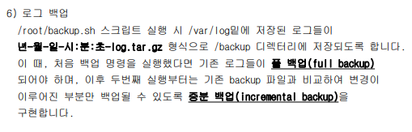

# BashShell-Script


```shell
#!/bin/bash

echo "****************************************************"
echo "             시스템 취약점 점검을 실시합니다.         "
echo "****************************************************"
echo "시작 시간 : $(date)"
echo ""

passwd=$(ls -al /etc/passwd | cut -c 1-10)
echo "01. /etc/passwd 파일 권한 점검"
if [ $(ls -al /etc/passwd | cut -c 8-10) == "r--" ]; then
    echo "  ===> [양호] 현재 권한 : $passwd"
else
    echo "  ===> [취약] 현재 권한 : $passwd"
fi

echo ""
echo "02. 라우팅 기능 활성화 여부 점검"
if [ $(cat /proc/sys/net/ipv4/ip_forward) == "0" ]; then
    echo "  ===> [양호] 라우팅 기능이 비활성화 되어 있습니다."
else
    echo "  ===> [취약] 라우팅 기능이 활성화 되었습니다."
fi

echo ""
echo "03. SetUID, SetGID, Sticky bit 파일을 검색하여 저장합니다. 저장 위치는 /root/flist.txt 입니다."
find / -type f -perm -o+t 2>/dev/null > /root/flist.txt
find / -type f -perm -u+s 2>/dev/null >> /root/flist.txt
find / -type f -perm -g+s 2>/dev/null >> /root/flist.txt
```



```sh
#!/bin/bash
STR=""
FLAG=0

# backup을 이미 했다면
if test -f "/backup/list"; then
				# 기존의 파일인지 확인하고, 변경됐거나 새로운 파일이라면 추가하는 코드
        ls -l /var/log | while read line;
        do
                FLAG=0
                while read file;
                do
                        if [ "$line" == "$file" ]; then
                                FLAG=1
                                break
                        fi
                done < /backup/list

                if [ $FLAG == 0 ]; then
                        echo ${line} >> /backup/save
                fi
        done

				# save파일이 있다면
        if test -f "/backup/save"; then
                while read line;
                do
                        read -a t <<< $line # line을 t라는 변수에 저장
                        STR+="/var/log/${t[-1]} " # 새로운 파일을 STR에 저장, 그리고 띄어쓰기 있음
                done < /backup/save
                rm -rf /backup/save
         fi
        tar -cpzf /backup/$(date "+%Y-%m-%d-%H:%M:%S")-log.tar.gz --wildcards $STR 2>/dev/null # STR 파일들만 압축시켜 주겠다
        ls -l /var/log > /backup/list

# backup을 안했다면 backup
else
        tar -cpzf /backup/$(date "+%Y-%m-%d-%H:%M:%S")-log.tar.gz --one-file-system /var/log 2>/dev/null
        ls -l /var/log > /backup/list
fi
```